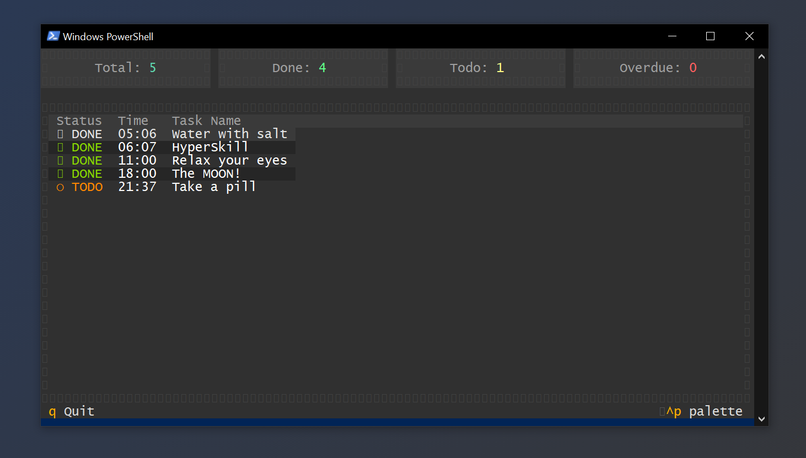
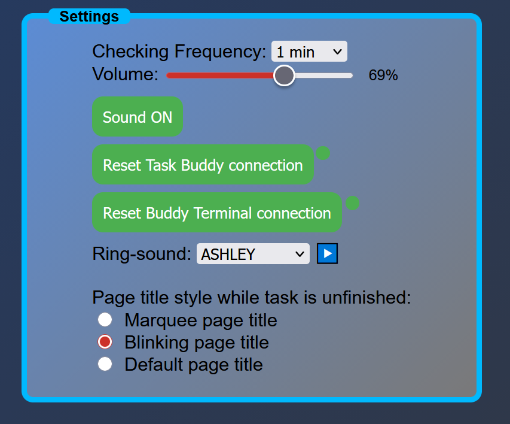

# Buddy Terminal



**A sleek terminal companion for [DidITakeIT](https://did-i-take-it.vercel.app/)**

Buddy Terminal is a Python-based terminal UI that displays your daily tasks from the DidITakeIT web app in a beautiful, real-time dashboard. Keep track of your tasks without leaving your terminal!

## Features

**Real-Time Task Display**  
Tasks sync automatically from your DidITakeIT web app - no refresh needed!

**Live Statistics Dashboard**  
- Total tasks
- Completed tasks  
- Pending todos
- Overdue tasks (highlighted in red!)

**Modern Terminal UI**  
Clean grey theme with color-coded statuses:
- 🟢 Green for completed tasks
- 🟡 Yellow for pending tasks
- 🔴 Red for overdue tasks

**Lightweight & Fast**  
Built with [Textual](https://github.com/Textualize/textual) for smooth performance

## Connected Buddy Terminal


> ###### (Running with Task Buddy)

## How It Works

1. **Web App Integration:**  
   Your DidITakeIT web app sends task data to the terminal server running on port `2137`

2. **Terminal Display:**  
   Buddy Terminal receives the updates and displays them in a beautiful table format

3. **Auto-Sorting:**  
   Tasks are automatically sorted by due time, making it easy to see what's coming up next

4. **Status Tracking:**  
   - ✔ **DONE** - Task completed (green, strikethrough)
   - ○ **TODO** - Pending task (yellow)
   - ⚠ **LATE** - Overdue task (red, bold)

## Installation

### Prerequisites
- Python 3.9+
- pip

### Setup

1. Clone the repository:
```bash
git clone https://github.com/Emil88PL/Buddy-Terminal.git
cd buddy-terminal
```

2. Install dependencies:
```bash
pip install textual aiohttp
```

## Usage

1. Start the terminal app:
```bash
python BuddyTerminal.py
```

2. Open your [DidITakeIT web app](https://did-i-take-it.vercel.app/) in your browser

3. Your tasks will automatically appear in the terminal!

4. Press `q` to quit the application

## Configuration

**Port:** The server runs on port `2137` by default  
**CORS:** Accepts connections from any origin (localhost-friendly)

## Technical Details

- **Framework:** [Textual](https://github.com/Textualize/textual) - Modern TUI framework
- **Server:** aiohttp web server for receiving task updates
- **Data Format:** JSON over HTTP POST
- **Time Handling:** Full timezone support with UTC conversion

## Keyboard Shortcuts

| Key | Action |
|-----|--------|
| `q` | Quit application |
| Arrow keys | Navigate tasks |

## Troubleshooting

- You can check status in the settings

- if it is showing **Disconnected** simply click "Reset Task Buddy connection"


**No tasks showing?**
- Ensure the web app is open and connected
- Check that both apps are running
- Look for "Connected • Updated at [time]" in the status bar

## Related Projects

**DidITakeIT Web App:** [Did I take it?](https://did-i-take-it.vercel.app/)  
The main task reminder web application

**Task Buddy (Express App)** [Task Buddy](https://chrome-ex-ten.vercel.app/)  


**Your Task Buddy companion for DidITakeIT!**

Task Buddy is an Express.js application that reads your tasks out loud using text-to-speech. It connects to the same DidITakeIT web app and:
- Announces tasks vocally when they're due
- **AI-Powered Motivation** - If you have [Ollama](https://ollama.ai/) installed (llama3), it generates unique motivational messages to help you complete each task
- Available as executable for Windows and Linux
---

 [](https://ko-fi.com/N4N51E08N8)
